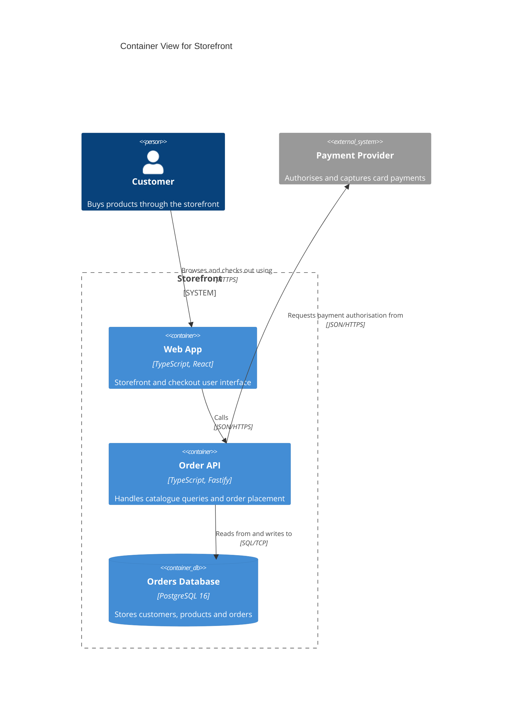
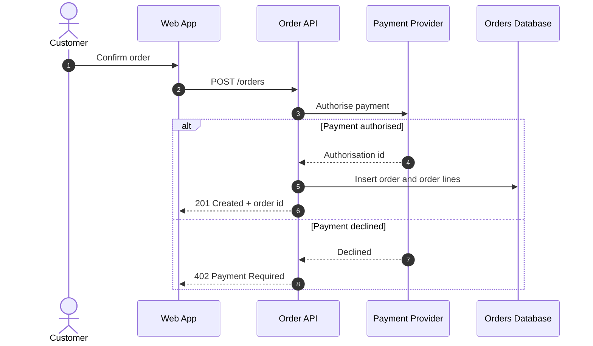
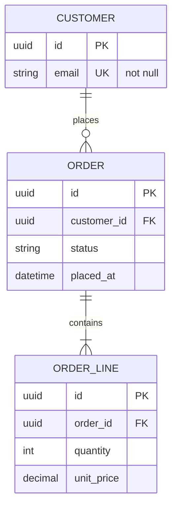

# Spec Kit C4 Model

Architecture diagrams for [Spec Kit](https://github.com/github/spec-kit) projects,
using the [C4 model](https://c4model.com/) for structure, sequence diagrams for
flows and ER diagrams for databases. Everything is Mermaid, so it renders on GitHub
and in most editors with no toolchain.

This repository holds two packages that work together. Both manifests sit at the
repository root, so one tag archive installs either:

| Package | Id | Manifest | What it does |
|---------|----|----------|--------------|
| Extension | `c4` | `extension.yml` | Adds the `speckit.c4.*` commands, two optional hooks, and the diagram templates and conventions (`commands/`, `templates/`) |
| Preset | `c4-model` | `preset.yml` | Makes `/speckit.plan` generate the diagrams itself, and links `spec.md` and `plan.md` to them (`preset/`) |

The extension works on its own. The preset needs the extension.

## What you get

| Level | File | Contents | Written by |
|-------|------|----------|------------|
| Project | `docs/architecture/context.md` | C4 system context (level 1) | `speckit.c4.system` |
| Project | `docs/architecture/containers.md` | C4 container view (level 2) | `speckit.c4.system` |
| Project | `docs/architecture/erd.md` | Whole-system ER diagram | `speckit.c4.system` |
| Feature | `specs/<feature>/architecture.md` | C4 component views (level 3), a sequence diagram per flow, the feature's ER diagram, and an Architecture Impact table | `/speckit.plan` with the preset, or `speckit.c4.feature` |

The project-level views are living documents. Each feature records what it changes
in its Architecture Impact table, and `speckit.c4.system` merges that into the
project-level views once the feature is built.

See the [Mermaid C4 layout evaluation](docs/c4-layout-evaluation.md) for rendered
comparisons and the declaration-order guidance used by the templates.

How the documents reference each other:

- `spec.md` gets a **System Context** section linking to `context.md` and listing
  the people and external systems the feature involves.
- `plan.md` gets an **Architecture** section linking to the feature's
  `architecture.md` and to `context.md`, `containers.md` and `erd.md`.
- `architecture.md` links back to its spec, plan, data model and contracts, and each
  sequence diagram names the user story it covers.

## Install

Requires Spec Kit 1.0.0 or later and a project created with `specify init`.
Install the extension first, then the preset. Both come from the same release zip:

```bash
specify extension add c4 --from https://github.com/leejsinclair/speckit-c4Model/archive/refs/tags/v0.2.0.zip
specify preset add --from https://github.com/leejsinclair/speckit-c4Model/archive/refs/tags/v0.2.0.zip
```

### From a local clone

```bash
specify extension add --dev /path/to/speckit-c4Model
specify preset add --dev /path/to/speckit-c4Model
```

`--dev` copies the package into `.specify/`, so after pulling changes re-run the
extension command with `--force`, and for the preset run
`specify preset remove c4-model` before adding it again.

## Releasing

There is no build step. GitHub generates the zip for every tag, and Spec Kit
installs straight from it.

1. Set the same new version in `extension.yml` and `preset.yml`, and add a
   `CHANGELOG.md` entry.
2. Update the two URLs in the Install section above to the new tag.
3. Commit, then tag and push:

   ```bash
    git tag v0.2.0
    git push origin main v0.2.0
   ```

The zip is then at
`https://github.com/leejsinclair/speckit-c4Model/archive/refs/tags/v0.2.0.zip`.

## Use

With both packages installed, the normal workflow produces the diagrams:

1. `/speckit.specify` writes `spec.md` with a System Context section.
2. `/speckit.plan` writes `architecture.md` in Phase 1, after `data-model.md` and
   `contracts/`, then offers to run `speckit.c4.validate`.
3. `/speckit.implement` finishes by offering to run `speckit.c4.system`, which merges
   the feature's changes into `docs/architecture/`.

Run `speckit.c4.system` once on an existing project to create the project-level
views from the constitution, existing specs and the codebase.

### Commands

| Command | Purpose |
|---------|---------|
| `speckit.c4.system` | Create or update `context.md`, `containers.md` and `erd.md` |
| `speckit.c4.feature` | Generate or refresh the current feature's `architecture.md` |
| `speckit.c4.validate` | Read-only check of syntax, C4 rules and consistency with the spec, plan, data model and contracts |

How a command is invoked depends on your agent, for example `/speckit-c4-system` in
Claude Code and `/speckit.c4.system` in agents that use dotted command names.

`speckit.c4.validate` parses diagrams with the
[Mermaid CLI](https://github.com/mermaid-js/mermaid-cli) (`mmdc`) when it is
installed and falls back to a manual review when it is not.

### Layout optimisation

Mermaid places C4 elements in declaration order. When Python 3 and a Mermaid CLI
are available, the commands use `scripts/python/c4_layout.py` (standard library only) to
render each C4 diagram and measure it: lines through unrelated elements, label
overlaps and crossings. A diagram that is already readable is left alone.
Otherwise the script renders up to five orderings of the same elements, ranks
them, and the agent picks one after looking at the images. Only declaration order
changes; a fidelity check confirms the elements, boundaries and relationships are
identical. Without Python or a renderer the existing order is kept and the report
says the layout was not checked. The procedure is in the "Layout optimisation"
section of the conventions.

### Hooks

Both hooks are optional: the agent asks before running them.

| Event | Command |
|-------|---------|
| `after_plan` | `speckit.c4.validate` |
| `after_implement` | `speckit.c4.system` |

### Configuration

`.specify/extensions/c4/c4-config.yml`:

```yaml
architecture_dir: "docs/architecture"   # project-level views
feature_file: "architecture.md"         # per-feature document name
mermaid_cli: "mmdc"                     # or "npx -y @mermaid-js/mermaid-cli"
```

## Conventions

The rules every diagram follows are in
[`templates/c4-conventions.md`](templates/c4-conventions.md):
one C4 level per diagram, stable element names across views, a technology and
description on every container and component, labelled relationships, sequence
participants that exist in the C4 views, and ER diagrams that map one-to-one to
`data-model.md`. Mermaid's C4 diagrams are still marked experimental, so the
conventions restrict output to a subset of the syntax.

## Examples

A container view:



A flow:



A data model:



## Contributing

See [CONTRIBUTING.md](CONTRIBUTING.md) for development setup, how to check a change
and what a pull request needs.

## License

Released under the [MIT License](LICENSE). Copyright (c) 2026 Lee Sinclair.
