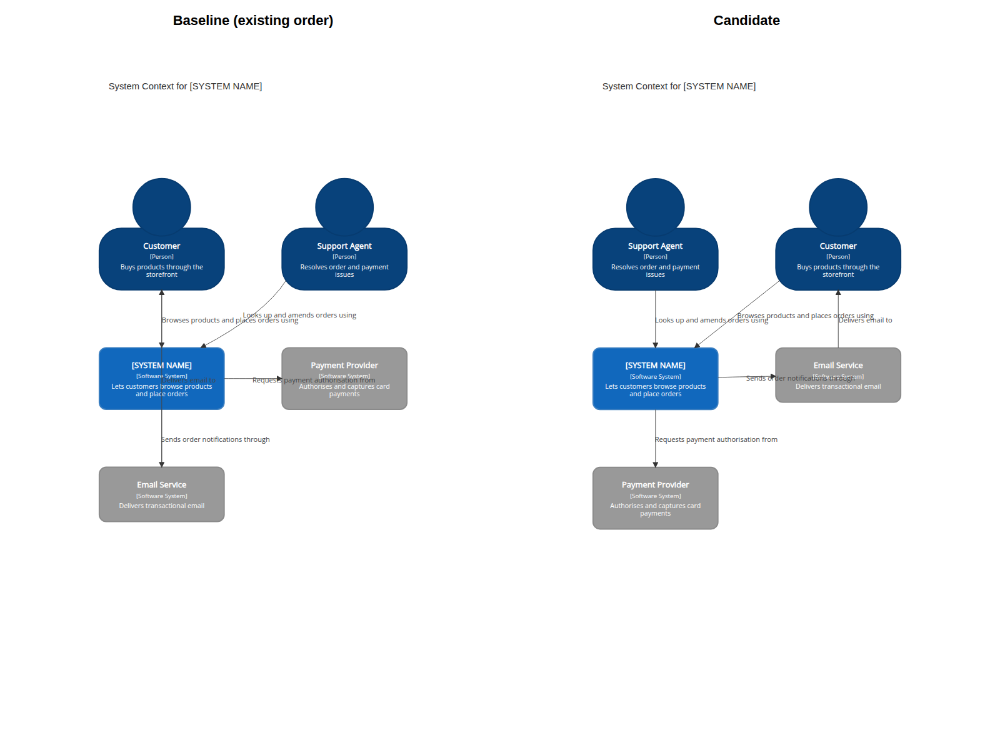
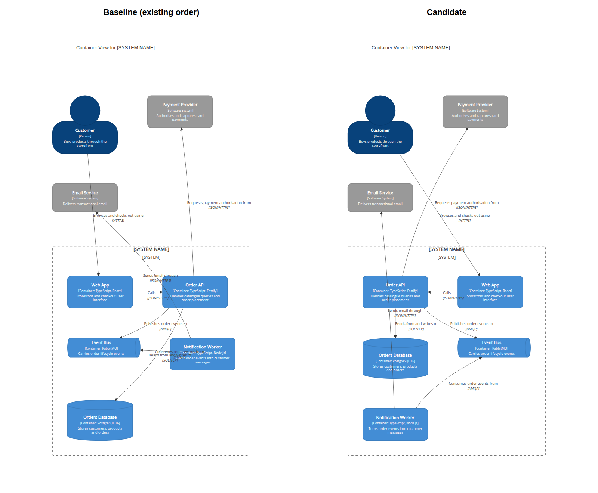
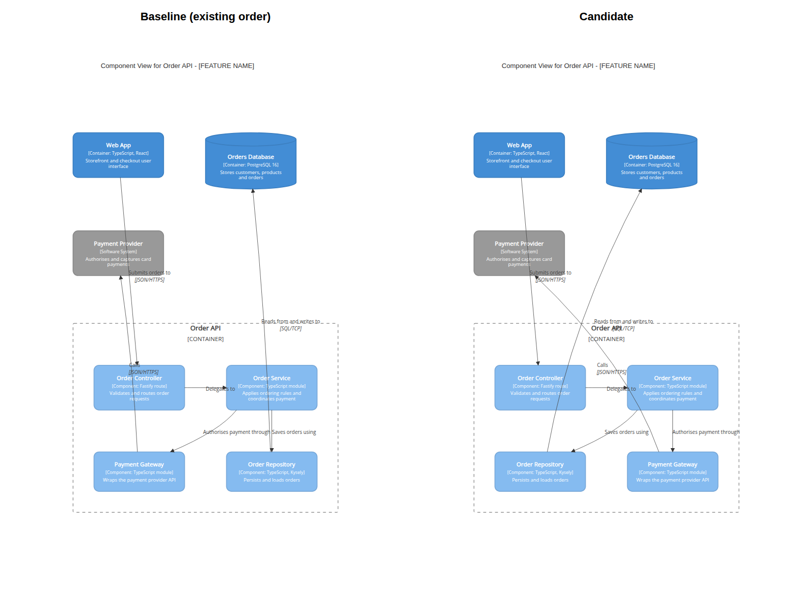

# Mermaid C4 layout evaluation

This evaluation compares declaration order and native row-width settings using the
context, container and component examples in the C4 templates. The candidate diagrams
only reorder existing declarations; aliases, labels, descriptions, boundaries and
relationships are unchanged.

## Results

Baseline and selected candidate screenshots use the same Mermaid CLI 12.0.0 renderer,
Chromium 154.0.8037.57, default theme and white background. Each comparison is a
1600-pixel-wide rendered screenshot.

| View | Baseline | Selected result | Baseline N/O/X/T/L | Selected N/O/X/T/L | Score change | Canvas area |
|------|----------|-----------------|--------------------|--------------------|--------------|-------------|
| Context | Existing order | Reverse people and external-system peers, keeping the system between them | 1/2/0/2/3.69 | 0/2/0/2/2.72 | 184.37 → 84.27 (54.3% lower) | 1.01× |
| Container | Existing order | Order API, Web App, Orders Database, Event Bus, Notification Worker | 2/5/2/8/10.27 | 2/2/1/4/10.99 | 437.03 → 299.10 (31.6% lower) | 1.00× |
| Component | Existing order | Keep existing order; tested connected order was worse | 3/4/0/2/8.75 | 3/4/0/2/8.75 | 464.87 → 464.87 (unchanged) | 1.00× |

`N` is the number of relationship routes through unrelated element boxes; `O` is the
number of overlapping unrelated label/element or label/label pairs; `X` is the number
of proper relationship-line crossings; `T` is the number of routes through unrelated
relationship labels; and `L` is total relationship-route length divided by median
element width. Lower is better. The score is `100N + 40O + 10X + 2T + 0.1L`.
Coincident route pairs are reported separately: context baseline 2, selected context
0; none were measured in the container or component views. All candidates remained
within 1.5× of their baseline canvas area.

### Candidate rankings

| View | Rank | Approach | N/O/X/T/L | Score |
|------|------|----------|-----------|-------|
| Context | 1 | Reverse both peer groups (selected) | 0/2/0/2/2.72 | 84.27 |
| Context | 2 | Reverse external systems only | 0/3/1/3/3.17 | 136.32 |
| Context | 3 | Existing order; row widths 2–6 and reversed relationships tie | 1/2/0/2/3.69 | 184.37 |
| Context | 4 | Reverse people only | 1/3/0/5/4.01 | 230.40 |
| Context | 5 | Unconstrained graph order | 2/1/1/3/6.14 | 256.61 |
| Container | 1 | Connectivity-aware, central Order API first (selected) | 2/2/1/4/10.99 | 299.10 |
| Container | 2 | Primary interaction path first | 3/2/0/0/10.30 | 381.03 |
| Container | 3 | Existing order; row widths 2–6 tie | 2/5/2/8/10.27 | 437.03 |
| Container | 4 | Reverse relationship declarations | 2/5/3/5/10.24 | 441.02 |
| Component | 1 | Existing order; row widths 2–6 and reversed relationships tie | 3/4/0/2/8.75 | 464.87 |
| Component | 2 | Move repository beside service | 3/5/1/4/9.38 | 518.94 |

### Context

The selected order reduces unrelated-box intersections and route length, and removes
coincident routes. Reversing only people was worse (230.40); reversing only external
systems scored 136.32. A graph order that moved the system ahead of the people scored
256.61, so the selected result preserves the people → system → external-systems
grouping.

### Container

The selected graph-centered order makes the highly connected Order API adjacent to
its Web App and database dependencies, followed by the event bus and its notification
consumer. A primary-path order (Web App, Order API, database, event bus, notifier)
scored 381.03 (12.8% lower than baseline), but the selected order ranked better on the
combined proxy. It reduces label collisions and route-label intersections while also
reducing crossings; it does not eliminate every route through an unrelated box.

### Component

The existing order is the winner. Moving the repository beside the service before the
payment gateway increased the score by 11.6%, so the template keeps its original
ordering.

## Other approaches and limitations

- `UpdateLayoutConfig($c4ShapeInRow="2".."6", $c4BoundaryInRow="1")` produced
  byte-identical SVG geometry in Mermaid CLI 12.0.0, both alone and with the tested
  connected order. Row tuning is therefore not recommended without confirming its
  effect in the renderer used by a project.
- Reversing relationship declaration order did not improve the context or component
  results; the container score rose slightly from 437.03 to 441.02.
- Scores rank candidates only within each diagram. The SVG proxy samples routes in
  rendered coordinates, groups multi-line relationship labels, excludes intended
  endpoints and shared route endpoints, and counts coincident routes separately.
  It approximates readability; screenshots remain necessary to catch ambiguous
  arrowheads, whitespace and other visual issues.
- Mermaid C4 is experimental. Mermaid CLI output may differ from GitHub or editor
  renderers, and these template examples are not a substitute for checking actual
  project diagrams in their target renderer.
