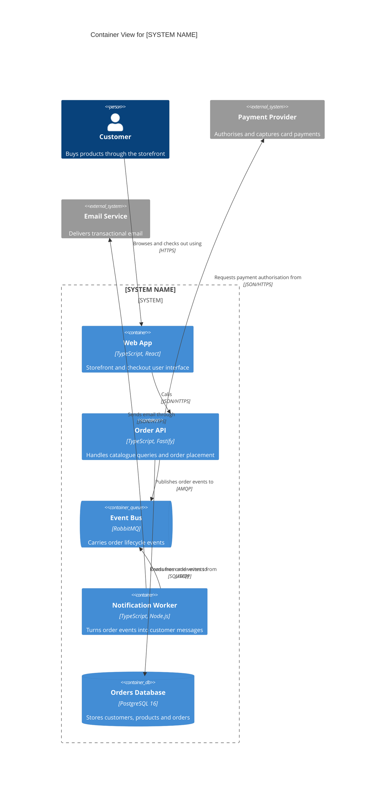

# Containers: [SYSTEM NAME]

**C4 level**: 2 - Container | **Last updated**: [DATE] | **Updated for**: [###-feature-name or "initial"]
**Related views**: [System context](./context.md) | [Data model](./erd.md)

<!--
  ACTION REQUIRED: Replace the example diagram and tables with the real system.
  A container is something that must be running for the system to work: an
  application, a service, a database, a queue, a file store. Do not show components.
  People and external systems must match context.md exactly.
-->

## Diagram

## Containers

| Container | Technology | Responsibility | Source location | Component views |
|-----------|------------|----------------|-----------------|-----------------|
| [Container 1] | [Language, framework] | [What it is responsible for] | [path/in/repo] | [Links to feature architecture.md files that detail it] |

## Communication

| From | To | Purpose | Protocol | Sync / Async |
|------|----|---------|----------|--------------|
| [Container 1] | [Container 2] | [Why] | [JSON/HTTPS, SQL, AMQP...] | [Sync / Async] |

## Change Log

| Date | Feature | Change |
|------|---------|--------|
| [DATE] | [###-feature-name] | [Container added / changed / removed, relationship added...] |
