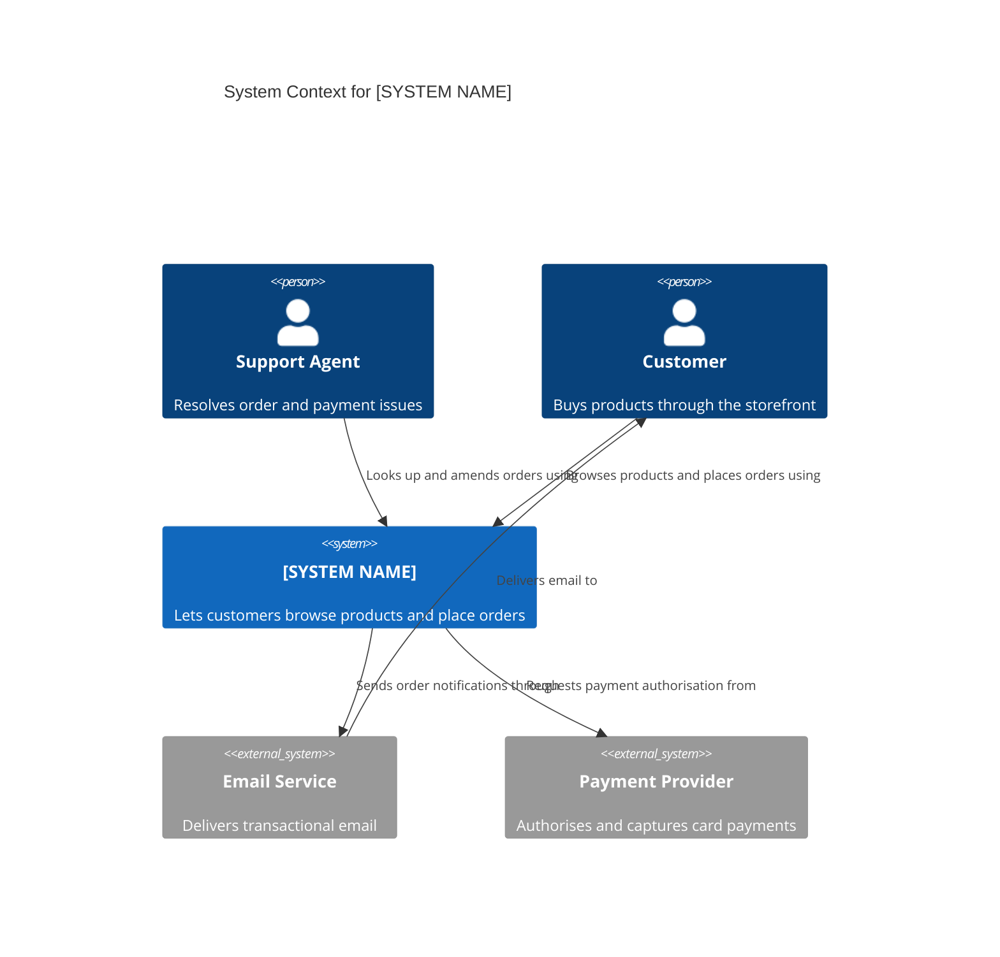

# System Context: [SYSTEM NAME]

**C4 level**: 1 - System context | **Last updated**: [DATE] |
**Updated for**: [###-feature-name or "initial"]
**Related views**: [Containers](./containers.md) | [Data model](./erd.md)

<!--
  ACTION REQUIRED: Replace the example diagram and tables with the real system.
  Show the system as ONE box. Do not show containers, technologies or internals.
-->

## Diagram

## People

| Person | Description | Goals |
|--------|-------------|-------|
| [Person 1] | [Who they are] | [What they need from the system] |

## External Systems

| System | Description | Direction | Owned by |
|--------|-------------|-----------|----------|
| [External system 1] | [What it does for us] | [Outbound / Inbound / Both] | [Team or vendor] |

## Scope

**In scope**: [What the system is responsible for]

**Out of scope**: [What is deliberately left to people or external systems]
