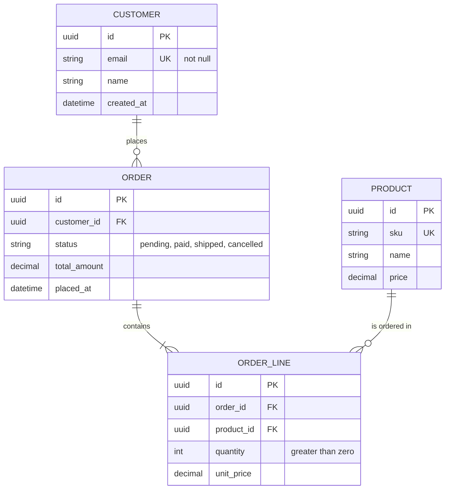

# Data Model: [SYSTEM NAME]

**View**: Entity relationship | **Last updated**: [DATE] | **Updated for**: [###-feature-name or "initial"]
**Related views**: [System context](./context.md) | [Containers](./containers.md)

<!--
  ACTION REQUIRED: Replace the example diagram and tables with the real data model.
  This is the whole-system model. Each feature's data-model.md and architecture.md
  describe the slice that feature adds or changes.
  If the system has more than one database, use one "## [Database name]" section
  with its own diagram per database container in containers.md.
-->

## [Database container name]

## Entities

| Entity | Purpose | Owning container | Introduced by |
|--------|---------|------------------|---------------|
| [ENTITY_1] | [What it represents] | [Container that writes it] | [###-feature-name] |

## Change Log

| Date | Feature | Change |
|------|---------|--------|
| [DATE] | [###-feature-name] | [Entity / attribute / relationship added, changed or removed] |
