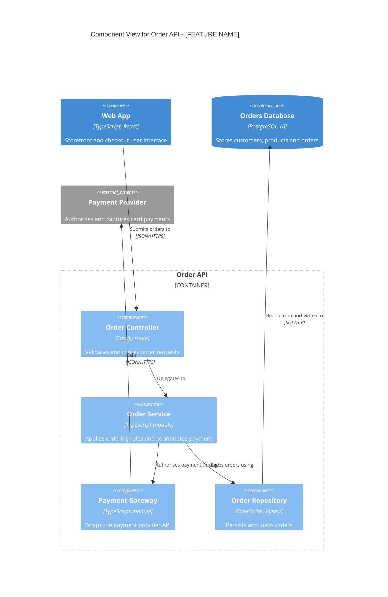
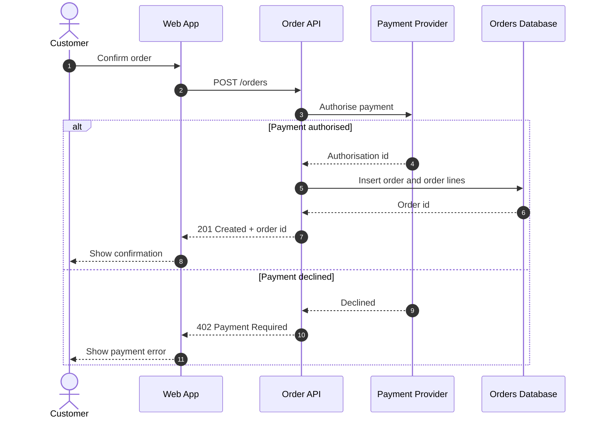
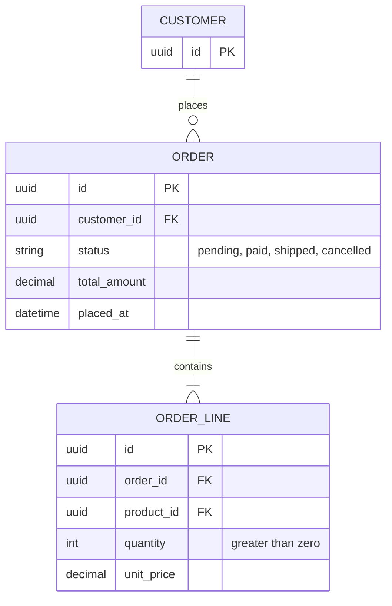

# Architecture: [FEATURE NAME]

**Feature**: `[###-feature-name]` | **Date**: [DATE]
**Feature docs**: [Spec](./spec.md) | [Plan](./plan.md) | [Data model](./data-model.md) | [Contracts](./contracts/)
**System views**: [Context]([relative path to context.md]) | [Containers]([relative path to containers.md]) | [ERD]([relative path to erd.md])

<!--
  ACTION REQUIRED: Replace every example below with this feature's real design.
  Follow the C4 conventions document. Remove a section's example and write
  "Not applicable: [reason]" when the feature genuinely has nothing for it
  (for example, no persistent data).
-->

## Components

<!--
  One subsection and one C4Component diagram per container this feature adds or
  changes. Show the components this feature touches plus the neighbours they talk to.
-->

### [Container name]

| Component | Responsibility | Technology | Status | Source location |
|-----------|----------------|------------|--------|-----------------|
| [Component 1] | [What it does] | [Technology] | [New / Changed / Existing] | [path/in/repo] |

## Flows

<!--
  One sequence diagram per user story's primary path, plus any alternate or failure
  path that shapes the design. Participants must be elements from the C4 views.
-->

### Flow 1: [Flow name] (User Story [N])

**Covers**: [FR-### list, acceptance scenarios]
**Notes**: [Timeouts, retries, idempotency, ordering guarantees worth stating]

## Data

<!--
  ER diagram of the entities in this feature's data-model.md, plus existing entities
  they relate to (show those with keys only). Mark each entity New / Changed /
  Existing in the table.
-->

| Entity | Status | Stored in | Notes |
|--------|--------|-----------|-------|
| [ENTITY_1] | [New / Changed / Existing] | [Database container] | [Migration or constraint notes] |

## Architecture Impact

<!--
  Every change this feature makes to the project-level views. This table is what
  gets merged into context.md, containers.md and erd.md once the feature is built.
  Write "None" in the Change column of a single row if a view is unaffected.
-->

| View | Change | Element | Detail |
|------|--------|---------|--------|
| Context | [Add / Change / Remove / None] | [Person or external system] | [What and why] |
| Containers | [Add / Change / Remove / None] | [Container or relationship] | [What and why] |
| ERD | [Add / Change / Remove / None] | [Entity, attribute or relationship] | [What and why] |
